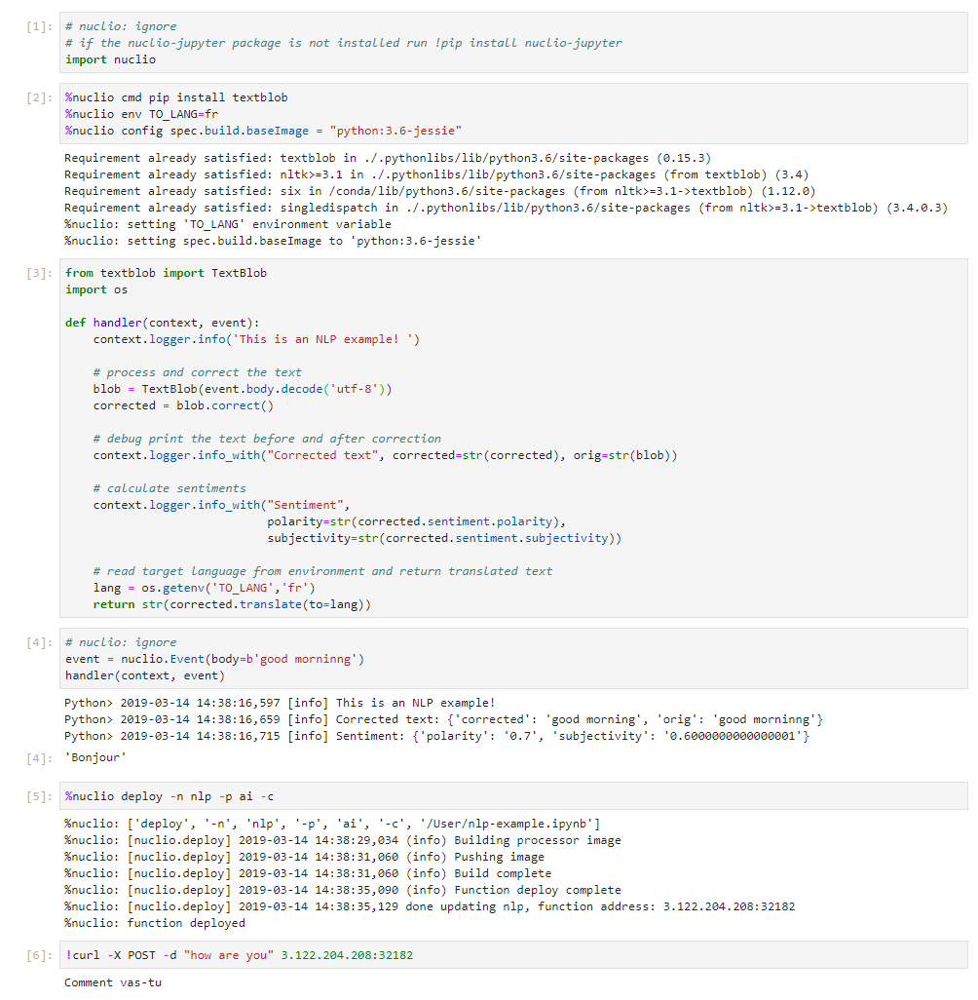
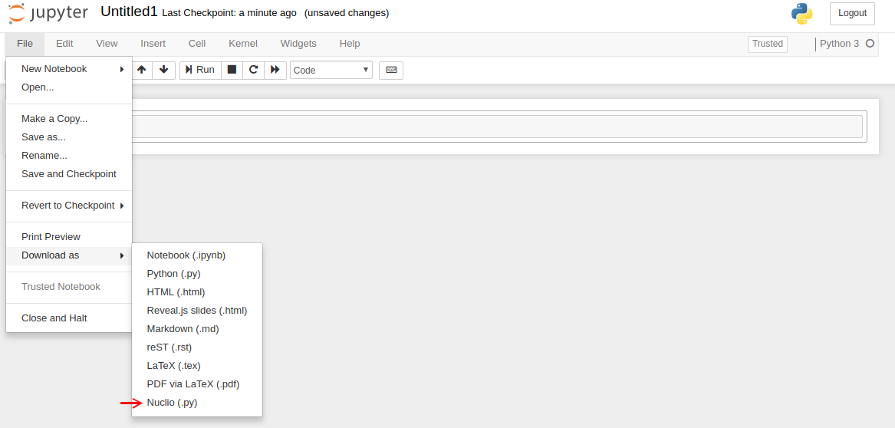

# Nuclio Function Automation for Python and Jupyter 

[](https://opensource.org/licenses/Apache-2.0)

Python package for automatically generating and deploying [nuclio](https://github.com/nuclio/nuclio) 
serverless functions from code, archives or Jupyter notebooks.
Providing a powerful mechanism for automating code and function generation, 
simple debugging, lifecycle management, and native integration into data-science tools.<br>

#### The package provides the following features
* Automatically convert code/files + dependencies (environment, packages configuration, data/files)<br> into nuclio function spec or archive
* Automatically build and deploy nuclio functions (code, spec, or archive) onto a cluster
* Provide native integration into [Jupyter](https://jupyter.org/) IDE (Menu and %magic commands)
* Handle function+spec versioning and archiving against an external object storage (s3, http/s, git or iguazio)

#### What is nuclio?<br>
nuclio is a high performance serverless platform which runs over docker or kubernetes 
and automate the development, operation, and scaling of code (written in multiple supported languages).
nuclio functions can be triggered via HTTP, popular messaging/streaming protocols, scheduled events, and in batch.
nuclio can run in the cloud as a managed offering, or on any Kubernetes cluster (cloud, on-prem, or edge)<br>
[read more about nuclio ...](https://github.com/nuclio/nuclio) 

nuclio and this package are an integral part of [iguazio managed data science platform](https://www.iguazio.com/), you can see many end to end usage examples and notebooks in [iguazio tutorial](https://github.com/v3io/tutorials) repo.

#### How does it work?
nuclio take code + [function spec](https://github.com/nuclio/nuclio/blob/master/docs/reference/function-configuration/function-configuration-reference.md) + optional file artifacts and automatically convert them to auto-scaling services over Kubernetes.
the artifacts can be provided as a YAML file (with embedded code), as Dockerfiles, or as archives (Git or Zip).
function spec allow you to [define everything](https://github.com/nuclio/nuclio/blob/master/docs/reference/function-configuration/function-configuration-reference.md) from CPU/Mem/GPU requirements, package dependencies, environment variables, secrets, shared volumes, API gateway config, and more.<br>

this package is trying to simplify the configuration and deployment through more abstract APIs and `%nuclio` magic commands which eventually build the code + spec artifacts in YAML or Archive formats 
(archives are best used when additional files need to be packaged or for version control)

the `%nuclio` magic commands are simple to use, but may be limited, if you want more 
programmability use the [python API calls](#creating-and-deploying-functions-using-the-python-api)
(`build_file`, `deploy_file` and `deploy_code`) from your code or a notebook cell.
## Usage
* [Installing](#installing) 
* [Creating and debugging functions inside a notebook using `%nuclio` magic](#creating-and-debugging-functions-using-nuclio-magic)
* [Exporting functions using Jupyter UI](#exporting-functions-using-jupyter-ui)
* [Creating and deploying functions using the python API](#creating-and-deploying-functions-using-the-python-api)
  * [The ConfigSpec object, simple way to configure commands, env, triggers, and volumes](#the-configspec-object-simple-way-to-configure-commands-env-triggers-and-volumes)
  * [Running non python functions](#running-non-python-functions)
* [Exporting, versioning, and archiving functions](#exporting-versioning-and-archiving-functions)
* [Deploy functions or versions directly from archive or git](#deploy-functions-or-versions-directly-from-archive-or-git)
* [Controlling function code and configuration](#controlling-function-code-and-configuration):
  * [`# nuclio:` markers](#nuclio-code-section-markers--nuclio-ignorecode-startcode-end) - mark relevant code cells (ignore, start-code, end-code)
  * [`%nuclio cmd`](#cmd) - defining package dependencies 
  * [`%nuclio env`](#env) and [`env_file`](#env_file) - configuring local and remote env variables
  * [`%nuclio handler`](#handler) - function handler wrapper
  * [`%nuclio mount`](#mount) - mounting shared volumes into a function
  * [`%nuclio config`](#config) - resources, spec, and triggers configuration 
  * [`%nuclio build`](#build) - generate and/or upload function spec or archive 
  * [`%nuclio deploy`](#deploy) - deploy functions onto the cluster
  * [`%nuclio show`](#show) - show generated function code and spec (YAML)
* [Advanced topics](#advanced-topics) 
  * nuclio `init_context()` hook for initializing resources (across invocations)
  * changing `context.logger` verbosity level to DEBUG
  * using Docker
* [Links](#links)
* [Developing](#developing) 
* [Licence](#licence)

## Installing

    pip install  --upgrade nuclio-jupyter

Install in a Jupyter Notebook by running the following in a cell

```
# nuclio: ignore
!pip install --upgrade nuclio-jupyter
```

to access the library use `import nuclio`

## Creating and debugging functions using `%nuclio` magic 
`%nuclio` magic commands and some comment notations (e.g. `# nuclio: ignore`) 
help us provide non-intrusive hints as to how we want to convert the notebook into a full function + spec.
cells which we do not plan to include in the final function (e.g. prints, plots, debug code, etc.) are prefixed with `# nuclio: ignore`
if we want settings such as environment variables and package installations to automatically appear in the fucntion spec 
we use the `env` or `cmd` commands and those will copy them self into the function spec.<br>

> Note: if we want to ignore many cells at the beginning of the notebook (e.g. 
data exploration and model training) we can use `# nuclio: start` at the first relevant code cell 
instead of marking all the cells above with `# nuclio: ignore`.
<br>

after we finish writing the code we can simulate the code with the built-in nuclio `context` object
(see: debugging functions) and when we are done we can use the `export` command to generate the function YAML/archive 
or use `deploy` to automatically deploy the function on a nuclio/kubernetes cluster.  

we can use other commands like `show` to print out the generated function + spec, 
`config` to set various spec params (like cpu/mem/gpu requirements, triggers, etc.), 
and `mount` to auto-mount shared volumes into the function.<br>

for more details use the `%nuclio help` or `%nuclio help <command>`.
  
### Example:

Can see the following example for configuring resources, writing and testing code, 
deploying the function, and testing the final function.
note serverless functions have an entry point (`handler`) which is called by the run time engine and triggers. 
the handler carry two objects, a `context` (run-time objects like logger) and `event` 
(the body and other attributes delivered by the client or trigger).

We start with, import `nucilo` package, this initialize the `%nuclio` magic commands and `context` object
this section should not be copied to the function so we mark this cell with `# nuclio: ignore` (or we can use 
`# nuclio: start-code` or `# nuclio: end-code` to mark the code section in the notebook).


```python
# nuclio: ignore
import nuclio
```

#### Function spec/configuration

the following sections set an environment variable, install desired package, 
and set some special configuration (e.g. set the base docker image used for the function).
note the environment variables and packages will be deployed in the notebook AND in the function, 
we can specify that we are interested in having them only locally (`-l`) or in nuclio spec (`-c`).
we can use local environment variables in those commands with `${VAR_NAME}`, see `help` for details.
>note: `%` is used for single line commands and `%%` means the command apply to the entire cell, see [details](#controlling-function-code-and-configuration) 

```
%nuclio cmd pip install textblob
%nuclio env TO_LANG=fr
%nuclio config spec.build.baseImage = "python:3.7-buster"
```

magic commands only accept constant values or local environment variables as parameters 
if you are interested in more flexibility use `nuclio.build_file()` or `nuclio.deploy_file()`
API calls, see [python API calls](#creating-and-deploying-functions-using-the-python-api)
<br>

#### Function code

In the cell you'd like to become the handler, you can use one of two ways:
* create a `def handler(context, event)` function (the traditional nuclio way)
* or mark a cell with `%%nuclio handler` which means this cell is the handler function (the Jupyter way)

when using the 2nd approach we mark the return line using `# nuclio:return` at the end of it.

#### Local function testing

we can use the built-in nuclio `context` and `nuclio.Event` objects to simulate our functions locally,
we create an event object (message body, headers, etc.) and call our function with 
the `context` object and our new `event` object, this will simulate a generated event trigger.
we can also simulate the function with multiple events simply by using a `for` loop 

```python
# nuclio: ignore
event = nuclio.Event(body=b'good morninng')
handler(context, event)
```


#### Function build or deploy

once we are done we use the `%nuclio deploy` command to build the function and run it on a real cluster, 
note the deploy command return a valid HTTP end-point which can be used to test/use our real function.

deploy the code as nuclio function `nlp` under project `ai`:

    %nuclio deploy -n nlp -p ai

we can use `%nuclio build` if we only want to generate the function code + spec or 
archive and/or upload/commit them to an external repository without running them on the cluster 
this can also be used for automated CI/CD, functions can be built and pushed to GIT 
and trigger a CI process which will only deploy the function after it passed tests.

if you would like to see the generated code and YAML configuration file before you deploy use `%nuclio show` command

for more flexibility use the `nuclio.build_file()` or `nuclio.deploy_file()` API calls, see the example below:

```python
# nuclio: ignore
# deploy the notebook code with extra configuration (env vars, config, etc.)
spec = nuclio.ConfigSpec(config={'spec.maxReplicas': 2}, env={'EXTRA_VAR': 'something'})
addr = nuclio.deploy_file(name='nlp',project='ai',verbose=True, spec=spec, tag='v1.1')

# invoke the generated function 
resp = requests.get('http://' + addr)
print(resp.text)
``` 

> Note: Cells containing `# nuclio: ignore` comment will be omitted in the build
process.


### Example Notebook: 



visit [this link](docs/nlp-example.ipynb) to see the complete notebook
, or check out this [other example](docs/nuclio-example.ipynb)
 

The generated function spec for the above notebook will look like:

```yaml
apiVersion: nuclio.io/v1
kind: Function
metadata:
  name: nuclio-example
spec:
  build:
    baseImage: python:3.7-buster
    commands:
    - pip install textblob
    noBaseImagesPull: true
  env:
  - name: TO_LANG
    value: fr
  handler: handler:handler
  runtime: python
```

## Exporting functions using Jupyter UI
in many cases we just want to export the function into a YAML/Zip file and loaded manually to nuclio (e.g. via nuclio UI).
this package automatically register itself as a Jupyter converter, which allow exporting a notebook into nuclio format,
see example below, choose `File/Download as/Nuclio` in Jupyter notebook 
> Note: you might need to mark the notebook as `Trusted` in order for the Nuclio option to show



Or you can run

```
jupyter nbconvert --to nuclio example.ipynb
```

This will create `example.yaml` or `example.zip` (if the function include extra files) with your code, spec, and extra files.

We currently don't support [Google Colaboratory][colab], [Kaggle Notebooks][kaggle] and other custom Jupyter versions.

[colab]: https://colab.research.google.com
[dashboard]: https://nuclio.io/docs/latest/introduction/#dashboard
[kaggle]: https://www.kaggle.com/kernels

## Creating and deploying functions using the python API
in some cases working from a notebook is an overkill, or we may want to generate code and configurations programmatically,
the `nuclio` package provide two main function calls `deploy_code` and `deploy_file` which allow us direct access as shown below:

```python
import requests
import nuclio

# define my function code template
code='''
import glob
def handler(context, event):
    context.logger.info('{}')
    return str(glob.glob('/data/*'))
'''

# substitute a string in the template 
code = code.format('Hello World!')
# define a file share (mount my shared fs home dir into the function /data dir)
vol = nuclio.Volume('data','~/')

# deploy my code with extra configuration (env vars, mount)
spec = nuclio.ConfigSpec(env={'MYENV_VAR': 'something'}, mount=vol)
addr = nuclio.deploy_code(code,name='myfunc',project='proj',verbose=True, spec=spec)

# invoke the generated function 
resp = requests.get('http://' + addr)
print(resp.text)

```

the `deploy_file` API allow deploying functions from various file formats (`.ipynb`, `.py`, `.go`, `.js`, `.java`, `.yaml`, or `.zip` archives) <br>
the `build_file` API is the equivalent of `%nuclio build` magic command (create deployable function or archive and can upload it)

> The first attribute in those functions is the filename, if left blank it will use the current notebook as source

### The ConfigSpec object, simple way to configure commands, env, triggers, and volumes

the `ConfigSpec` provide a structures API for configuring functions, the class have the following methods:

* `set_env(name, value)` - add environment variable 
* `set_config(key, value)` - add spec attribute 
* `add_volume(local, remote, kind, name, key, readonly)` - add a Kubernetes Volume (v3io or PVC)
* `add_trigger(name, spec)` - add a trigger (see below) 
* `with_v3io()` - add `v3io` environment variables

methods can be nested, example:

```python
# nuclio: ignore
spec = nuclio.ConfigSpec(cmd=build_commands)\
    .set_config('build.baseImage', 'python:3.7-buster')\
    .add_volume(local='User', remote='~/')

spec.with_v3io()
spec.add_trigger('web', nuclio.triggers.HttpTrigger(workers=4, port=32005).ingress(name, host, paths))
spec.add_trigger('cron', nuclio.triggers.CronTrigger(interval='20s', body='scheduled_retraining'))
spec.add_trigger('kafka', nuclio.triggers.KafkaTrigger(url, topic, partitions).sasl(user, password))

addr = nuclio.deploy_file(name='training', project='netops', verbose=False, spec=spec)
```

> Note: such a section must be outside the code cells, use [code section markers](#nuclio-code-section-markers--nuclio-ignorecode-startcode-end).

### Running non python functions

the library is not limited to python code, it support other languages such as `go`, 
`node.js`, `java`, and `bash`. see the following example with bash code. note that 
you can install any package/binary inside the function using the build commands (`cmd=`).<br>

```python
import requests
import nuclio

code = '''
echo "good morning"
echo $SOME_ENV
'''

spec = nuclio.ConfigSpec(env={'SOME_ENV':'env text'}, 
                         cmd=['apk --update --no-cache add imagemagick'])
                         
addr = nuclio.deploy_code(code, lang='.sh', name='mysh', project='demo', spec=spec)

# invoke the generated function 
resp = requests.get('http://' + addr)
print(resp.text)
```

output:

    good morning
    env text
 
## Exporting, versioning, and archiving functions 
nuclio functions are a great way to provide well defined code + dependencies + environment definitions,
functions can be versioned, archived, and restored by simply storing and re-applying their artifacts.

after we defined a functions using the `%nuclio` magic commands or directly from the API, we can `build` them,
we can also use the `add` magic command or `files` API attribute to pack multiple files in the same `zip` archive with the code and spec,
store it locally or upload the archive to cloud storage using a single command.<br>

when we want to deploy a function from a URL or archive we use the `deploy` command or API, 
specify the URL (vs the code or notebook) as source and the function will be deployed automatically. 

we currently support the following archive options:<br>
local/shared file system, http(s) unauthenticated or with Basic auth, Github, AWS S3, and iguazio PaaS.
> note: that at this point nuclio doesnt support pulling archives directly from secret protected S3 buckets  

see `build` and `deploy` commands help below for details 


#### Example using magic commands

specify additional files to pack with the function (will force the use of `zip`)
```
%nuclio add -f model.json -f mylib.py
```
convert the current notebook into a function archive and upload into remote object store 
```
%nuclio build -p myproj -t v1.1 -o s3://my-bucket/sub-dir -a
``` 
deploy and older version from an archive and name it `newfunc`
```
%nuclio deploy https://my-bucket.s3.amazonaws.com/sub-dir/myproj/funcname_v1.1.zip -n newfunc 
``` 

> note: `build` and `deploy` commands dont have to run from the same notebook, see `help` for detailed command options. 

#### Example using the API

```python
# nuclio: ignore
spec = nuclio.ConfigSpec(env={'TO_LANG':'de'})
nuclio.build_file(name='nlp', spec=spec, project='proj',tag='v7', verbose=True, 
                  output_dir='v3io:///bigdata', archive=True)

# deploy the archived function  
spec = nuclio.ConfigSpec(env={'TO_LANG':'fr'})               
addr = nuclio.deploy_file('v3io:///bigdata/proj/nlp_v7.zip', name='nlp2', spec=spec, project='p1',tag='v8')

# invoke the generated function 
resp = requests.get('http://' + addr)
print(resp.text)
```
## Deploy functions or versions directly from archive or git 

users can deploy functions from an archive (`.zip` file) or Git repository, 
and override various function `spec` parameters (e.g. change environment variables, 
add a custom trigger, etc.). 

functions are versioned (using the `tag` attribute), we can load from a version 
and deploy under a version (which can have a different tag)

in order to deploy from an archive you must specify an archive source URL (must start with
 `http(s)://`, `v3io://`, or `git://`)
 
example:

    %nuclio deploy https://myurl.com/projects/myfunc-v1.zip -n myfunc -p myproj

### Deploy functions directly from Github

example: deploying functions from nuclio examples repository 

```python
addr = nuclio.deploy_file('git://github.com/nuclio/nuclio#master:/hack/examples/python/helloworld',name='hw', project='myproj')
resp = requests.get('http://' + addr)
print(resp.text)
```

the Git URL convention is: `git://[token@]github.com/org/repo#master[:<workdir>]`, 
tokens are only needed for private repositories and can also be provided through the
`GIT_ACCESS_TOKEN` environment variable.

`workdir` is optional, specify the sub directory for the function within the repository

To upload function artifact (`function.yaml` + code + extra files) to git you can generate the artifacts using the `build` 
command (specify desired `output-dir`), followed by committing and pushing the updates into your Git repo. 

note that you can specify the desired branch in the url.

## Controlling function code and configuration

### nuclio code section markers (`# nuclio: ignore/code-start/code-end`)

A user may want to include code sections in the notebook which should not 
translate to function code, for that he can use the following code markers (comment lines):

* `# nuclio : ignore` - ignore the current cell when building the function
* `# nuclio : code-start` - ignore any lines prior to this line/cell
* `# nuclio : code-end` - ignore any cell from this cell (included) to the end 

### cmd

Run a command, add it to "build.Commands" in exported configuration.

    Examples:
    In [1]: %nuclio cmd pip install chardet==1.0.1

    In [2]: %%nuclio cmd
    ...: apt-get install -y libyaml-dev
    ...: pip install pyyaml==3.13

If you'd like to only to add the instructions to function.yaml without
running it locally, use the '--config-only' or '-c' flag

    In [3]: %nuclio cmd --config-only apt-get install -y libyaml-dev
    
### env  

Set environment variable. Will update "spec.env" in configuration.

    Examples:
    In [1]: %nuclio env USER=iguzaio
    %nuclio: setting 'iguazio' environment variable

    In [2]: %%nuclio env
    ...: USER=iguazio
    ...: PASSWORD=t0ps3cr3t
    ...:
    ...:
    %nuclio: setting 'USER' environment variable
    %nuclio: setting 'PASSWORD' environment variable

> Note: there is a magic environment variable `%v3io` which adds the v3io 
connection env vars to the function, e.g. `%nuclio env %v3io`

If you'd like to only to add the instructions to function.yaml without
running it locally, use the '--config-only' or '-c' flag

    In [3]: %nuclio env --config-only MODEL_DIR=/home

If you'd like to only run locally and not to add the instructions to
function.yaml, use the '--local-only' or '-l' flag

### env_file

Set environment from file(s). Will update "spec.env" in configuration.

    Examples:
    In [1]: %nuclio env_file env.yml

    In [2]: %%nuclio env_file
    ...: env.yml
    ...: dev-env.yml
    
### handler
Mark this cell as handler function. You can give optional name

    %%nuclio handler
    context.logger.info('handler called')
    # nuclio:return
    'Hello ' + event.body

    Will become

    def handler(context, event):
        context.logger.info('handler called')
        # nuclio:return
        return 'Hello ' + event.body
        
### mount
Mount a shared file Volume into the function.

    Example:
    In [1]: %nuclio mount /data /projects/netops/data
    mounting volume path /projects/netops/data as /data
    
### config

Set function configuration value (resources, triggers, build, etc.).
Values need to numeric, strings, or json strings (1, "debug", 3.3, {..})
You can use += to append values to a list.

see the [nuclio configuration reference](https://github.com/nuclio/nuclio/blob/master/docs/reference/function-configuration/function-configuration-reference.md)

    Example:
    In [1] %nuclio config spec.maxReplicas = 5
    In [2]: %%nuclio config
    ...: spec.maxReplicas = 5
    ...: spec.runtime = "python2.7"
    ...: build.commands +=  "apk --update --no-cache add ca-certificates"

### build

Build notebook/code + config, and generate/upload yaml or archive.

    %nuclio build [filename] [flags]

    when running inside a notebook the the default filename will be the
    notebook it self

    -n, --name path
        function name, optional (default is filename)
    -t, --tag tag
        version tag (label) for the function
    -p, --project
        project name (required for archives)
    -a, --archive
        indicate that the output is an archive (zip)
    -o, --output-dir path
        Output directory/file or upload URL (see below)
    --handler name
        Name of handler function (if other than 'handler')
    -e, --env key=value
        add/override environment variable, can be repeated
    -v, --verbose
        emit more logs

    supported output options:
        format:  [scheme://[username:secret@]path/to/dir/[name[.zip|yaml]]
                 name will be derived from function name if not specified
                 .zip extensions are used for archives (multiple files)

        supported schemes and examples:
            local file: my-dir/func
            AWS S3:     s3://<bucket>/<key-path>
            http(s):    http://<api-url>/path
            iguazio:    v3io://<api-url>/<data-container>/path

    Example:
    In [1] %nuclio build -v
    In [2] %nuclio build --output-dir .
    In [3] %nuclio build /path/to/code.py --handler faces
    In [4] %nuclio build --tag v1.1 -e ENV_VAR1="some text" -e ENV_VAR2=xx
    In [5] %nuclio build -p myproj -t v1.1 --output-dir v3io:///bigdata -a


### deploy
Deploy notebook/file with configuration as nuclio function.

    %nuclio deploy [file-path|url] [options]

    parameters:
    -n, --name path
        function name, optional (default is filename)
    -p, --project
        project name (required)
    -t, --tag tag
        version tag (label) for the function
    -d, --dashboard-url
        nuclio dashboard url
    -o, --output-dir path
        Output directory/file or upload URL (see below)
    -a, --archive
        indicate that the output is an archive (zip)
    --handler name
        Name of handler function (if other than 'handler')
    -e, --env key=value
        add/override environment variable, can be repeated
    -v, --verbose
        emit more logs

    when deploying a function which contains extra files or if we want to
    archive/version functions we specify output-dir with archiving option (-a)
    (or pre-set the output using the NUCLIO_ARCHIVE_PATH env var
    supported output options include local path, S3, and iguazio v3io

    following urls can be used to deploy functions from a remote archive:
      http(s):  http://<api-url>/path.zip[#workdir]
      iguazio:  v3io://<api-url>/<data-container>/project/name_v1.zip[#workdir]
      git:      git://[token@]github.com/org/repo#master[:<workdir>]

    Examples:
    In [1]: %nuclio deploy
    In [2] %nuclio deploy -d http://localhost:8080 -p tango
    In [3] %nuclio deploy myfunc.py -n new-name -p faces
    In [4] %nuclio deploy git://github.com/myorg/repo#master -n myfunc -p proj

    
### show
Print out the function code and spec (YAML).
You should save the notebook before calling this function.

## Advanced topics

### nuclio `init_context()` hook for initializing resources (across invocations)

TBD

### changing `context.logger` verbosity level to DEBUG
by default the built-in context object is set to print logs at INFO level and above,
if we want to print out the debug level logs we can type the following 

    nuclio.context.set_logger_level(True)
    
this logging level only apply to the notebook/emulation, to change the function runtime 
log level you should use the `config` or nuclio UI.

### using Docker

You can build a docker image and try it out

#### Build

    $ docker build -t jupyter-nuclio .

#### Run

    $ docker run -p 8888:8888 jupyter-nuclio

Then open your browser at http://localhost:8888

## Links

* [iguazio tutorial repo](https://github.com/v3io/tutorials) - hosts many usage examples

## Developing

We're using [pipenv](https://docs.pipenv.org/) as package manager. To install
dependencies run

    $ pipenv sync -d

To run the tests run
    
    $ pipenv run python -m pytest -v tests

To upload to pypi either run `make upload` after changing version in
`nuclio/__init__.py` or `python cut_release <version>`. The latter will update
the version in `nuclio/__init__.py`. You can use `+` for the next version. Ask
around for pypi credentials.

## Licence

Apache 2.0 (see [LICENSE.txt](LICENSE.txt))
