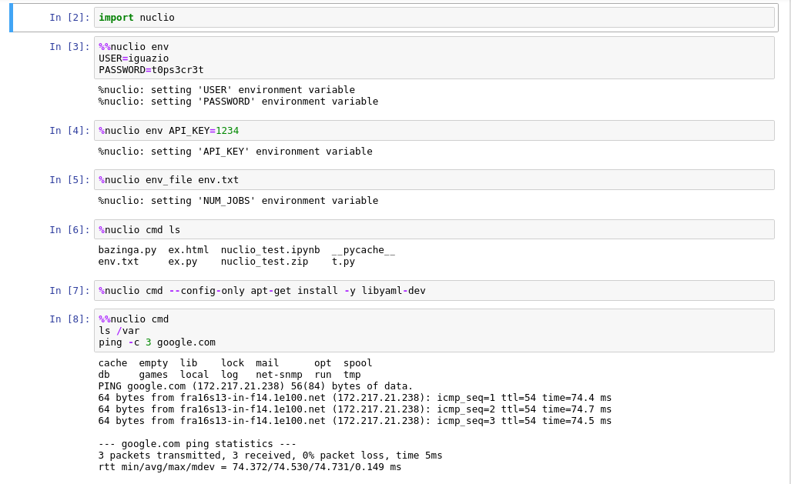
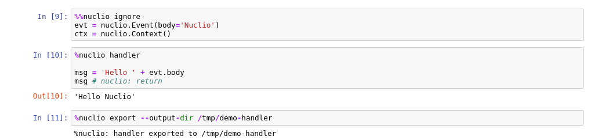
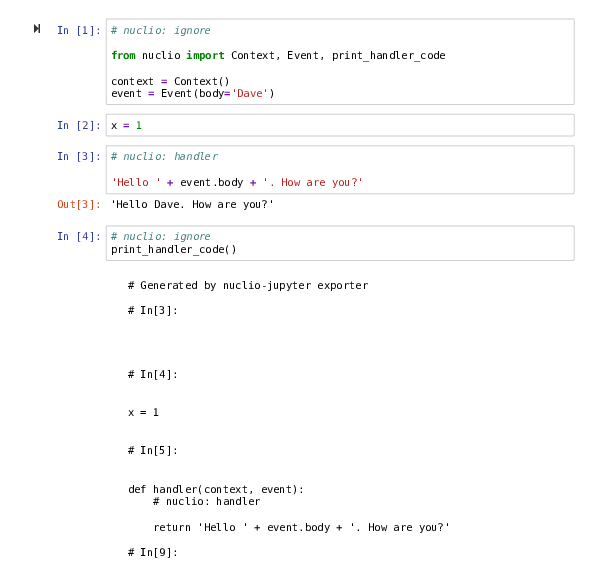

# nuclio Jupyter Export

[](https://travis-ci.org/nuclio/nuclio-jupyter)
[](https://opensource.org/licenses/Apache-2.0)

Convert Jupyter notebook to Python code that can run as [nuclio](https://nuclio.io/) handler

## Installing

    pip install nuclio-jupyter

### Install in Notebook

Run the following in a cell

```
# nuclio: ignore
!pip install nuclio-jupyter
```

## Usage

When developing, import `Context` and `Event` from `nucilo` and use it to
generate a mock context and request.

```python
import nuclio
```

Then
```python
# nuclio: ignore
from nuclio import Context, Event

context = Context()
event = Event(body='Hello Nuclio')
# your code goes here
```

In the cell you'd like to become the handler, added the magic `%%nuclio
handler` If there's a specific line you'd like to be the returned one - added
`# nuclio:return` at the end of it.

Cells containing `# nuclio: ignore` comment will be omitted in the export
process.

Now choose `File/Download as/Nuclio` in Jupyter notebook (you might need to
mark the notebook as `Trusted` in order for the Nuclio option to show)


Or you can run

```
jupyter nbconvert --to nuclio example.ipynb
```


This will create `example.zip` with your code wrapped in handler function and
`function.yaml` nuclio configuration file.

### Example





Will generate a zip file with

`handler.py`

```python
# Generated by nuclio.export.NuclioExporter on 2018-12-10 08:26:39.086907

import nuclio

def handler(context, event):
   msg = 'Hello ' + evt.body
   return msg # nuclio: return
```

and `function.yaml`

```yaml
# Generated by nuclio.export.NuclioExporter on 2018-12-10 08:26:39.095522
apiVersion: nuclio.io/v1
build:
 commands:
 - ls
 - apt-get install -y libyaml-dev
 - ls /var
 - ping -c 3 google.com
kind: Function
metadata: {}
spec:
 env:
   API_KEY: '1234'
   NUM_JOBS: '2'
   PASSWORD: t0ps3cr3t
   USER: iguazio
 handler: handler:handler
 runtime: python:3.6
```

### Other Notebooks

We currently don't support [Jupyter Lab][lab], [Google Colaboratory][colab],
[Kaggle Notebooks][kaggle] and others.

You can use `nuclio.print_handler_code` or `nuclio.save_handler_code` to
print/save the handler code and then copy&paste it to [the nuclio
dashboard][dashboard].




[colab]: https://colab.research.google.com
[dashboard]: https://nuclio.io/docs/latest/introduction/#dashboard
[kaggle]: https://www.kaggle.com/kernels
[lab]: http://jupyterlab.readthedocs.io

## Try It Out

You can build a docker image and try it out

### Build

    $ docker build -t jupyter-nuclio .

### Run

    $ docker run -p 8888:8888 jupyter-nuclio

Then open your browser at http://localhost:8888


## Developing

We're using [pipenv](https://docs.pipenv.org/) as package manager. To install
dependencies run

    $ pipenv sync -d

To run the tests run
    
    $ pipenv run python -m pytest -v tests

## Licence

Apache 2.0 (see [LICENSE.txt](LICENSE.txt))
