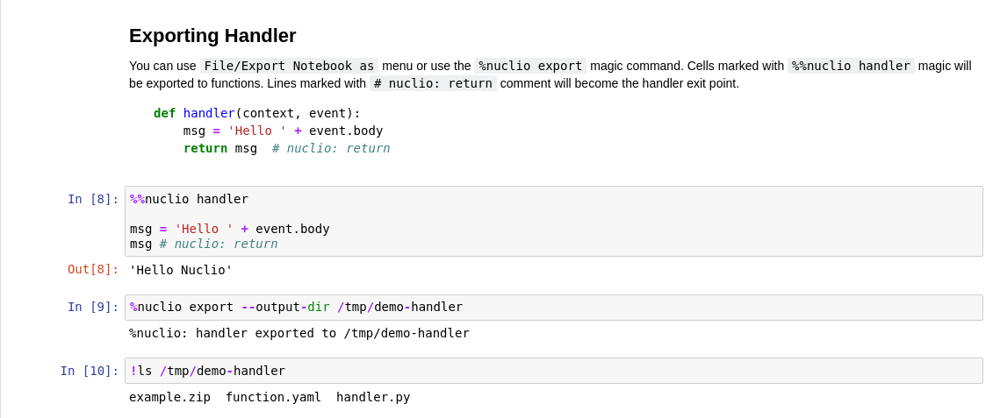

.. nuclio-jupyter documentation master file, created by
   sphinx-quickstart on Sun Jul 29 12:42:22 2018.
   You can adapt this file completely to your liking, but it should at least
   contain the root `toctree` directive.

Welcome to nuclio-jupyter's documentation!
==========================================

Various utilities to work with nuclio_ in Jupyter notebook

.. _nuclio: https://nuclio.io/

Once you import ``nucilo`` a ``context`` object will be injected into the
notebook namesapce.

.. code-block:: python

    # nuclio: ignore
    from nuclio import Event

    event = Event(body='Hello Nuclio')
    # your code goes here

In the cell you'd like to become the handler, use the magic ``%nuclio
handler``. If there's a specific line you'd like to be the returned one - added
``# nuclio:return`` comment at the end of it.

Cells containing ``# nuclio: ignore`` comment will be omitted in the export
process.

Now choose ``File/Download as/Nuclio`` in Jupyter notebook (you might need to
mark the notebook as ``Trusted`` to make this option show)

.. image:: menu.png

Or you can run

.. code-block:: bash

    jupyter nbconvert --to nuclio example.ipynb

This will create ``example.zip`` with your code wrapped in handler function also
``function.yaml`` nuclio configuration file.

Example
~~~~~~~

.. image:: jupyter-nuclio-1.png
.. image:: jupyter-nuclio-2.png

Will generate a zip file with ``handler.py``

.. code-block:: python

   # Generated by nuclio.export.NuclioExporter on 2018-12-10 08:26:39.086907

   import nuclio

   def handler(context, event):
       msg = 'Hello ' + str(event.body)
       return msg # nuclio: return

And ``function.yaml``

.. code-block:: yaml

   # Generated by nuclio.export.NuclioExporter on 2018-12-10 08:26:39.095522
   apiVersion: nuclio.io/v1
   kind: Function
   metadata: {}
   spec:
     runtime: python
     handler: handler:handler
     env:
       - name: API_KEY
         value: '1234'
       - name: NUM_JOBS
         value: '2'
       - name: PASSWORD
         value: t0ps3cr3t
       - name: USER
         value: guazio
   build:
     commands:
     - apt-get install -y libyaml-dev

Other Notebooks
~~~~~~~~~~~~~~~

We currently don't support `Jupyter Lab`_, `Google Colaboratory`_,
`Kaggle Notebooks`_ and others.

You can use ``nuclio.print_handler_code`` to print the handler code and then
copy&paste it to `the nuclio dashboard`_.

.. _Jupyter Lab: http://jupyterlab.readthedocs.io
.. _Google Colaboratory: https://colab.research.google.com
.. _Kaggle Notebooks: https://www.kaggle.com/kernels
.. _the nuclio dashboard: https://nuclio.io/docs/latest/introduction/#dashboard

Developing
----------

To install dependencies run

.. code-block:: bash

    $ pip install -e ".[dev]"

To run the tests run
    
.. code-block:: bash

    $ python -m pytest -v tests

API Reference
-------------

If you are looking for information on a specific function, class, or method,
this part of the documentation is for you.

.. toctree::
   :maxdepth: 2

   api
   magic

Indices and tables
==================

* :ref:`genindex`
* :ref:`modindex`
* :ref:`search`
